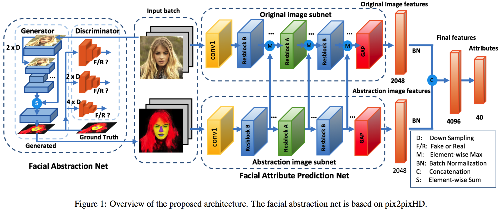

# FaceAttribute-FAN

This respository includes a Caffe implementation of [FAN](https://www.ijcai.org/proceedings/2018/102) that achieves state-of-the-art performance on [CelebA](http://mmlab.ie.cuhk.edu.hk/projects/CelebA.html) and LFWA face attribute benchmark.


### Citation

If this code is helpful for your research, please cite the following paper:

    @article{he2018harnessing,
      title={Harnessing Synthesized Abstraction Images to Improve Facial Attribute Recognition.},
      author={Keke He, Yanwei Fu, Wuhao Zhang, Chengjie Wang, Yu-Gang Jiang, Feiyue Huang, Xiangyang Xue},
      journal={Proceedings of the Twenty-Seventh International Joint Conference on
               Artificial Intelligence, {IJCAI-18}},
      pages={733-740}
      year={2018}
    }

## Introduction


Our method leverages facial parts locations for better attribute prediction. A
facial abstraction is generated by a
Generative Adversarial Network (GAN). Then a dual-path facial attribute network is built which accepts inputs from original images and absraction images.

## Prerequisites
- Caffe
- Linux
- NVIDIA GPU + CUDA CuDNN 

## Getting Started

### Setup

Clone the github repository:

```bash
git  clone https://github.com/TencentYoutuResearch/FaceAttribute-FAN
cd FaceAttribute-FAN
```

### Model

Please download the trained models from [Google drive](https://drive.google.com/open?id=1DFd2pvLUEYo2CawaYH_CWVqsAiFtihcz), and put it into outputs folder.


### Demo
To test the dual-path model, 

```bash
sh demo_dual_path.sh
``` 
If you want to test your own image without synthesized abstraction image, you can

```bash
sh demo_single_path.sh
``` 
The name of 40 attributes can be found at [Appendix](#attr_table)

### Dataset
1. To train and evaluation the model on the CelebA benchmark, 
please download the CelebA dataset from [CelebA](http://mmlab.ie.cuhk.edu.hk/projects/CelebA.html). 
2. Please download pretrained model and synthesized abstraction images of CelebA dataset from [Google drive](https://drive.google.com/open?id=1DFd2pvLUEYo2CawaYH_CWVqsAiFtihcz).
3. Put the original CelebA and synthesized abstraction image under the data/CelebA folder, for example:
	
	```
	├── CelebA
	│   ├── img_align_celeba
	│   ├── img_celeba_pix2pix

	``` 

### Evaluation
```bash
cd evaluation
sh test_dual_path_celeba.sh
```

### Training 
```bash
cd models/dual_path_parse_resnet
sh train.sh
```

## Appendix

40 binary attributes in CelebA dataset. Output 0: without this attribute, 1: with this attribute.

<span id="attr_table">

|     Id    | Name |             Name in Chinese                |
| ------------ | --- | ------------------------------- |
| 0 | 5\_o\_Clock\_Shadow   | 短胡子 |
| 1 | Arched\_Eyebrows   | 弯眉毛|
| 2 | Attractive   | 有吸引力 |
| 3 | Bags\_Under\_Eyes   | 眼袋 |
| 4 | Bald   | 秃顶 |
| 5 | Bangs   | 刘海 |
| 6 | Big\_Lips   |厚嘴唇|
| 7 | Big\_Nose   | 大鼻子 |
| 8 | Black\_Hair   | 黑色头发 |
| 9 | Blond\_Hair   | 金色头发 |
| 10 | Blurry    | 模糊 |
| 11 | Brown\_Hair    | 棕色头发 |
| 12 | Bushy\_Eyebrows    | 浓眉毛 |
| 13 | Chubby    | 胖的 |
| 14 | Double\_Chin    | 双下巴 |
| 15 | Eyeglasses    | 眼镜 |
| 16 | Goatee    | 山羊胡子 |
| 17 | Gray\_Hair    | 灰白头发 |
| 18 | Heavy\_Makeup    |浓妆  |
| 19 | High\_Cheekbones    | 高颧骨 |
| 20 | Male    | 男性 |
| 21 | Mouth_Slightly\_Open    | 嘴巴微张 |
| 22 | Mustache    | 胡子，髭 |
| 23 | Narrow\_Eyes    | 小眼睛 |
| 24 | No\_Beard    | 没有胡子 |
| 25 | Oval\_Face    |  鸭蛋脸 |
| 26 | Pale\_Skin    | 皮肤苍白 |
| 27 | Pointy\_Nose    |  尖鼻子|
| 28 | Receding\_Hairline    | 发际线后移 |
| 29 | Rosy\_Cheeks    | 红润双颊 |
| 30 | Sideburns    |  连鬓胡子|
| 31 | Smiling    | 微笑 |
| 32 | Straight\_Hair    | 直发 |
| 33 | Wavy\_Hair    | 卷发 |
| 34 | Wearing\_Earrings    | 戴耳环 |
| 35 | Wearing\_Hat    | 戴帽子 |
| 36 | Wearing\_Lipstick    | 涂唇膏 |
| 37 | Wearing\_Necklace    |  戴项链 |
| 38 | Wearing\_Necktie    | 戴领带 |
| 39 | Young     |  年轻 |
</span>